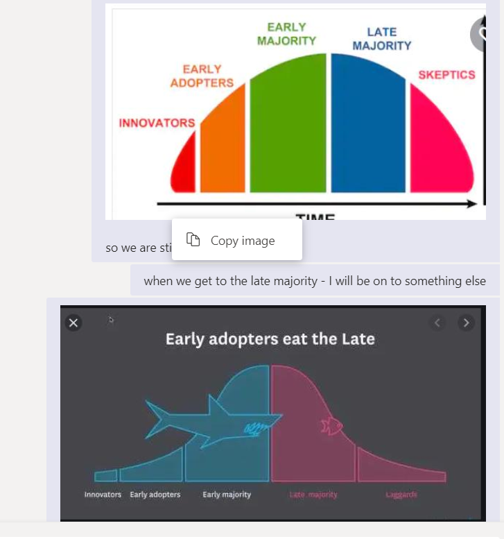

---
<u>define</u>

# Expected Audience 

- A scientist that wants Landsat and/or Sentinel at their findertips and wants to provide their output/product to a wide range of customers
- A scientist that wants to easily share models and papers with individuals inside and ouside of USGS.
- A young python programmer that wants to make an impact on the world

- A project scientist that wants to easily exploit AWS
- Anyone wanting to get good at Jupyter
- A scientist that wants to migrate from Windows to Linux
- A scientist that wants to move at a faster pace than currently afforded
- A technical support person that wants to do their job way more efficiently and effectively.
- You are an early adopter of cloud technologies and can envision the utility it will bring to your science.

## When? -- Class Schedule

- weekly - tuesdays at noon?
- odd weeks will be professor office hours 
	- independent labs
	- custom problems
		- moving and finding science data assets to/from AWS
		- python package wrangling
		- etc tbd ...
	


# Who is this class not for:
- Those close to retirement
- Those that don't mind driving cabs in an Uber world

---
# Vision

- Make Science Easy and Fun.

- Demonstrate PANGEO Architecture via practical science case studies

- Document AWS open source python tools for science

---
## Other Titles

- Harmony - for lots of reasons
- "Custom cloud training for the eclectic USGS/EROS science team"
- "Deep Dive into PANGEO; pangeo bootcamp"
- "One size fits all PANGEO training FAILED to make a big enough impact!"
- "Day in the Life of a New Cloud Science Project"
- " ET Case Study"
- "permaFrost case study"
- Ten things to do immediately with your new CHS CUSTOM ACCOUNT


---
## Computers and Website

A compute/computer/ec2/instance in the cloud is the same as a computer in EROS's CR2!
- let me say that again
	- A computer in the cloud is the **SAME** as a computer in EROS's CR2!
	- linux is linux wherever it swims

```
The INSTANCE butzer-harmony-neal-web is running -- t2.micro
10.12.69.216


### also need a mini-pangeo -- aka the littleist jupyter hub HERE - action - whole class and tony

```

## A Tale of Two Computers
- We will use exactly **two** computers in this class - they will live happily in the CHS/AWS cloud
	- until we terminate them - ha ha ha - these are cattle not pets - don't get attached - attachment leads to dukkha!
- they will have:
	- **two names**
		- butzer-harmony-neal-web
		- butzer-harmony-neal-mini-pangeo-dev-prod-box
		-
	- **two ip address**
		- 10.12.69.216 --- ### VPN Access Only
		- 10.12.6x.yyy - tbd also need the VPN and ssh and or jupyter to access
		-
	- **two AWS instance types (leased):**
		- t2.micro - small and cheap
		- t3a-2xlarge - bigger and our workhorse
		

## Human Resources

I am looking for people who do Python in Jupyter to Join Forces

- I am hiring an SDSU Intern to do visualizations - fun job :-)
- I am hoping to have another .25 FTE
- but I really could use even more resources to make the cloud a better world for scientists
- I want to meet Alemayehu and compare cloud notes and discuss making more people accept Jupyter
	- even if they don't see/love the notebook
	- by creating codeless dashboards and better desktop integrations

---
## github

- https://github.com/tonybutzer/harmony

---
## KANBAN - kanboard - tony?

---
# Overview

- Project Initiation and Student Roadmap

- Practical Steps

- Why

- Cloud Differences

- Cloud Similarities

- Cloud Advantages

- Cloud Disadvantages

- ET Case Study

- PANGEO

- Jupyter

- AWS Compute

- AWS Storage

- AWS Public Data Available

- Data Wrangling
	- ssh 
	- scp

- Who from Science is Exploring the Cloud

- Project Specific Specialities
	- SageMaker and ML

---
## Students

- I will interview each student to find out how they want to apply this training
	- essentially their personal/custom goals for the AWS cloud.

---

- https://github.com/tonybutzer/harmony/blob/main/class/06-Instructor/01-Students.ipynb
- http://10.12.69.216:8080/notebooks/jovyan/06-Instructor/01-Students.ipynb

```
Pastick, Neal (Contractor) J

Postma, Kory (Contractor)

Bunde, Brett (Contractor)

Danielson, Patrick (Contractor)

Butzer, Tony (Contractor)

Dahal, Devendra (Contractor)

Wylie, Bruce K

Rover, Jennifer

Zhou, Qiang (Contractor)

Rigge, Matthew B

Boyte, Stephen

Smith, Kelcy (Contractor) L

Anthony, Michelle (Contractor) L
```


## Instructors Live

- Tony Butzer
- Nathan Roberts
- Aaron Friez
- Rich Signell

## Instructors by Example
- Ryan Abernathey - PANGEO
- Chris Holmes - COGS and STAC
- Matt Hansen - STAC
- Scott Henderson - Landsat and Sentinel Jupyter Examples

## Student Individual Goals:

### Comment
- Its great that we have a good cross-section of roles represented in this class
- mananagement - scientist - computer scientists - EXACTLY what is needed - its a partnership
- this should be a safe space - lets keep it that way

### Steffi
- My model runs pitifully slow in on-prem gear
- The ARc tools are starting to show their age and they are expensive
- I can't easily procure the tools and infrastructure I need to achieve my audacious goals.

**RESPONSE**
- Problem solved - next problem - "Ross Perot"

- we were able to collaborate with Universities
- we were easily able to share our output products with Ward Sanford, Wesley Zell and Gabriel Senay
- we started writing visualizations
- we think we can do so much more with just a tiny bit more staff
- the cloud infrastructure is vast if not infinite - the sky/cloud is the limit

### Jennifer
So, there are several aspects that I'm interested in. 
- One, as lead for LCMAP applications, our tools for the user community to use once LCMAP is in the cloud. My initial thoughts are mostly visualization. 
- There might also be workflows in py that we could move to a noteboook.
- Also, I have an interest from just a research perspective.

**RESPONSE**
- You have several of the same goals/needs as Steffi Kagone
- She wanted better/faster pipelines
- Jupyter is just the prototyping and developing tool - not everyone has to be proficient in jupyter
- Docker is the deployment tool - as a leader you should demand docker in your projects - and EROS has plenty of docker experts and we will be growing these daily.
- As a researcher - notebooks and now dashboards will make sharing your work easier
- Data asset sharing in the cloud is way easier than portals, ftp, http, machine to machine etc - and this capability will explode in the next 3 years - lets be ready and let's share the burden
- People complain about human silos and fiefdoms - in the cloud and with tools like M$ Teams we have the ability to complain by creating a healthy collaborative space free from over management and segmentation.
- Thanks for sitting in on these classes/discussions its important that we span some of the natural chasms in an organization

### Qiang

### Neal
- Understand the differences of GEE and AWS opensource
- Determine if Open Data Cube is useful to my science
- Stay warm - but not too warm to melt my permafrost.
- I am getting approval to stand up a CHS CUSTOM ACCOUNT - how do I effectively use that and can you help me with some of the devops and dataops aspects in AWS
- I think AWS has a ton of services how do I wade through all that - It looks like decision fatigue to me.

**RESPONSE**
- Yes I can help you with many of the cloud questions you will have - both directly and by finding the right technical resource at the right time - this is disruptive technology and a little fast paced - EROS may need to adapt its staffing models accordingly; There could be some cultural change risk there.
- Another answer is lets jump in and find out - the cloud is pay as go and ephemeral - its not hard to start up or shutdown - try that with on-prem gear.
- This class is really a project roadmap for your project and should help you answer some if not all the questions in the process. We will start with essentially one computer and one simple, scalable storage bucket and we can build and run your entire project with just these few elements. The AWS catalog is big and frightening - we will use just two services in my approach to the cloud.
- Jupyter is a great communication tool and very versatile even without python.
- My experience is that when efficient approaches are taken - those that remove too many choices - project milestones fall like dominoes. - Its easy to get distracted these days - so this requires discipline and intelligence.

- And oh, Neal I have your web computer stood up - it took 2 minutes with terraform and docker - you're welcome
- i'll get you logged in whenever you are ready - and give you a quick tour

**COMPUTER 1 - Web server; admin box; PLUS**
- instance type - t2.micro - free tier - no money needed
	- 1 cpu
	- 1 gig memory 
	- tiny but powerful
	- and essential free no charge - on the house - drinks are on me ... :-)

#### COMPUTER 2 - Development/Test/Production/Scaling101
- I'll build you a better one on tuesday
	- 8 CPUs
	- 32 Gig Memory
	- 200 Gig Disk
	- Infinite s3 storage
	- $200/month - also on me until you get your CHS account - we will move it there
		- I use AMD processors since they are cheaper than intels
		- instance type is t3a-2xlarge - these AWS names - wow!

- We will stand up a Jupyter Hub there - just cause it offers us so much in the way of collaboration
	- I have several geeks that like Jupyter we can leverage these folks
	- We will also build our docker pipeline with python on this machine - and scale bigger - if we need to - UNLIKELY.
	- You will have to be the sage in SageMaker - intelligence even the artificial type is not in my brain space.


### Bruce
- As a leader of a team of scientists I want to better understand the cloud and avoid any misunderstandings or pitfalls.
- I want to create a path from our current technology stack to a future one given that more and more pressure is being exerted from the cloud crowd
- My boss is suggesting we examine cloud technologies for my science initiatives
- Many proposals and in some cases our competitors will use cloud technologies - I don't want to be left behind
- I am not sure we have all of the management structures in place to accommodate things like the cloud
- I want EROS to be a world class data center on the prairie where we take a leadership role in integrating science with technology as a shared responsibility and we live that vision.

### ...more to come ...

## Questions, Suggestions, Improvements
- Just start a chat with tony butzer anytime - I will add the question and maybe the solution to this pangeo-cloud-web-training-student-teacher-guide-roadmap-sphinx-thingy.

## References

- https://lpdaac.usgs.gov/resources/e-learning/
- https://registry.opendata.aws/landsat-8/
- https://docs.opendata.aws/landsat-pds/readme.html
- https://corteva.github.io/rioxarray/stable/examples/clip_box.html
- https://corteva.github.io/rioxarray/stable/examples/convert_to_raster.html
