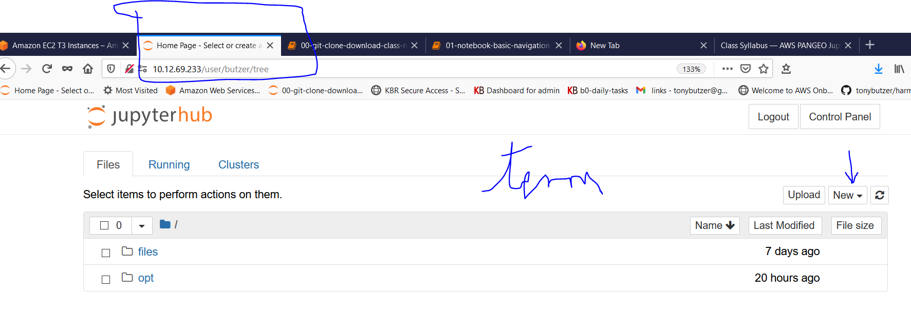

<u>Week by Week</u>

# Class Syllabus

## Prerequisites - Suggested Reading/Viewing

### Pangeo, COGS and maybe Stac


---


---
- The Future of Data-driven Discovery in the Cloud - Ryan Abernathey (Columbia University)
	- https://www.youtube.com/watch?v=7kDYfUe0Zhw
	- `The above youtube is worth watching - 14 minutes`


### COGs and ARD
- https://medium.com/planet-stories/cloud-native-geospatial-part-2-the-cloud-optimized-geotiff-6b3f15c696ed
- https://medium.com/planet-stories/towards-on-demand-analysis-ready-data-f94d6eb226fc

## Week by Week Class Summaries

### WEEK ONE
#### Week One Objectives

- FEEDBACK - send me direct chats with pithy comments that might improve our mission
- ESIP - don't hold back science - Rich Signell
- Discuss the goals for this class - success criteria - move one more science project to the cloud
- Comments and viewpoint of Neal Pastick
- Demos
	
	- [nginx on cloud server](http://10.12.69.188)
	- [jupyter notebook without the code](http://10.12.69.188/pie)
	- [ET Viewer Side by Side no timeseries sad](http://10.12.69.233/user/harmony/notebooks/notebook/00-Viz/96-hvplot-experiment-image-annual-et-viewer-decorator-version.ipynb)
	- [time series panel demo - little code](http://10.12.69.233/user/harmony/notebooks/notebook/00-Viz/panel-timeseries-get-x-y-and-plot.ipynb)

	- I will move some of these to Neal's interim web servers
- Discuss the Student cross section
	- http://10.12.69.216/00define_ET.html#students
	- http://10.12.69.216/00define_ET.html#student-individual-goals


- Discuss two Case Studies - Commonalities and Not
	- Evapo
	- permaFrost
- Contact Tony Butzer for cloud questions
- Discuss notebook love hate meter - any notebook shy/sensitive folks?
	- its just a tool; "you're a tool tony"
	- `There will be lots and lots of notebooks in this class`
- Point to the two computers - field any questions
	- web 10.12.69.216 hweb
		- [AWS on-boarding website paper --LINK](http://10.12.69.216)
	- mini-pangeo 10.12.69.233 harmony
		- [mini-pangeo --LINK](http://10.12.69.233)
- Computer Access Methods
	- Jupyter via browser and url and `VPN`
	- Terminal inside Jupyter
	- direct ssh and scp access - public key
		- ssh ubuntu@10.12.69.216
		- ssh ubuntu@10.12.69.233
	- open ports allowed via firewalls
		- 80, 8080 http
		- 443, 8443 https
		- 22 ssh,scp
	- use of `tmux` for session preservation across network/VPN failures/timeouts - long running jobs

- Point to the website - nginx/sphinx driven
	- [AWS on-boarding The website paper --LINK](http://10.12.69.216)
- Point to the github - 
	- [https://github.com/tonybutzer/harmony](https://github.com/tonybutzer/harmony)
- Quick Jupyter Session - jupyter fitting from single jupyter -- to self scaling hubs
	- focus here will be primarily mini-pangeo scope - a group of 13 students
- Self-directed study hints
	- notebook repo - past pangeo training
		- If you need one on one jupyter training I can arrange an hour with you
	- github link - needs pruning - notebook repo here: 
		- [https://github.com/tonybutzer/notebook/tree/master/00-Tutorial/00-Jupyter-Notebook-Pieschke](https://github.com/tonybutzer/notebook/tree/master/00-Tutorial/00-Jupyter-Notebook-Pieschke)
		- [https://github.com/tonybutzer/notebook](https://github.com/tonybutzer/notebook)
		- Tony can help you find just the right example or create it for you.
		- We wil use some of these examples in class and the Labs
- future todo - feedback based
	- create very small notebook snippets that illustrate concepts
	- refine sections of this "paper" and build examples
1. Project Kickoff and refinement of goals
	- Is this anything? - trial and error Seinfeld
		- doing this class is scary must be what its like to do stand-up comedy
		- this class is `new` sort of a science experiment in itself
	- `PRIOR Experience`
		- linux
		- docker
		- AWS
		- python
		- jupyter
		- management/leadership
	- `I want to build a notebook that radar charts the students`
	- Class questionnaire - via email - or maybe a notebook
	- Communication preference of each student
	- efficiency and boredom mitigation
		- perhaps split each 1 hour into - concepts and practice - allow folks to bail at 1/2 way point
		- perhaps - threads or channels
			- jupyter thread
			- linux thread
			- docker thread
			- devops thread
			- python thread
			- management leadership - steering committee thread for PANGEO - strategy

	- I want Neal to drive most of the agenda and deep dive talks - at least initially - people can opt out
		- for example I could write a chapter on costs in AWS
			-perhaps most would be interested - I know Neal is
1. Week ONE - DEC 1,2020 Introduction and Basic Cloud Tour 
	- Quick overview of this document
		- added a glossary
		- please skim
		- if you have comments or questions - please use Teams/Chat to contact me
			- I will likely post some of the converstaions in this document
	- Neal's team won a free mini-pangeo
		- terraform 
		- the littleist jupyter hub - intro
	- Neal wanted a kanban too/also
	- SEE DEVOPS WEEKLY
		- [DEVOPS LINK](http://10.12.69.216/27etops.html?highlight=devops)

## Teams Note
Hey Class: - the course website is starting to take shape and is here:
- http://10.12.69.216/
	
we will fill in more color/detail as we go through our CASE Studies.
- our companion github repo is here - can't live in the cloud without github/dockerhub.
	- https://github.com/tonybutzer/harmony

---
- this is also where our cache of notebooks will live - like this one:
	- https://github.com/tonybutzer/harmony/blob/main/class/06-Instructor/01-Students.ipynb
	- https://nbviewer.jupyter.org/github/tonybutzer/harmony/blob/main/class/06-Instructor/01-Students.ipynb
---
	- See you all on tuesday December 1st at 12 NOON 
	- See you next week for an open lab
	- The week after that I will look at Areas of Interest and how they relate to ET modeling
---
# WEEK TWO 

## Welcome to the JupyterHub and Pangeo

## Outline
- `Deep Thoughts` by Neal Pastick
	- Key takeawys from last week
	- Motivating words to inspire the troops to forge ahead.
- Review last Week
	- pangeo is great
	- cloud is great
	- public data assets stored in the cloud == game changing paradigm
		- you MUST start to use remote sensing assets - or be left behind
		- L8
		- Collection02
		- Sentinel
		- HLS ...bump ...bump ... YES
		- Evporation Model Outputs - after they go ScienceBase validatione
	- one computer to rule them all - t3a.2xlarge
		- https://aws.amazon.com/ec2/instance-types/t3/
		- 8 CPU, 32Gig Memory, 200Gig local-ebs-elastic-block-storage  - with S3 access
	- technology zen equation
```python
science_joy = 1 * ec2 + docker * 1e3
```

### Special Recognition for Kelcy (AWS CHS Credentials)

### "Hey Tony; can I have an account on Neal's mini-pangeo?"
- "Yep, Yes, trueDat, Si, qui, Ja"
- ## हो   
- ## Hō

---


## Student Getting Started Instructions
#### Signing into the jupyterhub-mini-pangeo

- 10.12.69.233
    - username is '[LASTNAME]'
    - password is `harmony`


### git repo clone

- clone our notebook repo
- next week we will do a `git pull` for updates

### Instructions



#### open a terminal in jupyter
    - find Home Page - browser tab - or middle click jupyterhub above - tony to demo
    - [new] button - terminal
    - pwd ; ls; 
---
- mkdir opt
- cd opt
- git clone http://github.com/tonybutzer/notebook
---

### Don't feel like cloning sheep
---


## Just use group login:

- http://10.12.69.233
- harmony
- harmony
---

## Winner Winner Chicken Dinner
- that is all I wanted to get accomplished
- Everything else this week is a bonus!

## How to cheat at Markdown
- Markdown is another zen item in the technology universe.

```
| sign | poet-line |
| ------:| -----------:|
| > | When the Star Belly Sneetches had frankfurter roasts
| > | Or picnics or parties or marshmallow toasts,
| > | They never invited the Plain-Belly Sneetches
| > | They left them out cold, in the dark of the beaches.
| > | They kept them away. 
| > | Never let them come near.
| > | And that’s how they treated them year after year.
| > | -- Dr. Seuss --
```

```
| sign | poet-line |
| ------| -----------|
| > | When the Star Belly Sneetches had frankfurter roasts
| > | Or picnics or parties or marshmallow toasts,
| > | They never invited the Plain-Belly Sneetches
| > | They left them out cold, in the dark of the beaches.
| > | They kept them away.
| > | Never let them come near.
| > | And that’s how they treated them year after year.
| > | -- Dr. Seuss --
```


### https://jonschlinkert.github.io/remarkable/demo/  -- [Clear] - 
- [https://jonschlinkert.github.io/remarkable/demo/](https://jonschlinkert.github.io/remarkable/demo/)
- try the above text in the remarkable wysiwig tool

---

## Notebook Drive By 


## Jupyter Roles/Features/Capabilities
- text editor
- python coding and exploring
- teaching tool - commands and output in the same place - writes text books as you go
- file transfer agent - upload and download files 
- web app development accelerator - panel package
- teleports people with a simple browser right inside their free computer
- AWS onboarding enabler - view the cloud - see the grand canyon without getting hurt
- terminal and bash access
- poor mans powerpoint tool
- and for `Science` - well that is what it was **born for** - for those that realize it anyway
- ... and so much ... 


2. WEEK THREE - Delaware River Basin AOI
	- https://panel.holoviz.org/reference/widgets/FileDownload.html
	- How to display AOI in Jupyter
		- geojson and shapefile
		- folium
2. LAB
3. Organizing our DATA Inputs in the Cloud
	- Fundamentals of S3
	- S3 is an object store
		- mostly not a big deal - but sometimes ...
	- Data Wrangling
	- Slow Data Transfers
		- ssh and scp
	- VPN do's and dont's 
3. LAB

---

## Project Initiation, Kickoff, and Approach

- Jump in with both feet approach.
- Gabriel Senay, Steffi Kagone - trail blazers
- Neal Pastick as trail blazer
- Continuous Training - Train The trainer
    - Example Steffi and Gabe Parish now writing visualizations directly

## Cloud Immersion Concept

### Use the cloud for EVERYTHING
- website
- kanban
- jupyter hub  - mini-pangeos
- all your data storage
    - move from clunky Netapps and archaic windows storage architectures
- leverage others work
- collaborate like hell

## Why

### For selfish reasons

- Impress your friends
- looks nice on the resume
- its more fun
- you don't have to deal with people you don't like

### Headlines

- Netflix Delivers Billions of Hours of Content Globally by Running on AWS 
- Steffi Kagone does 150 days of work in just THREE!

### Procurement delays not applicable

### Scalability

### USGS/DOI Efficiencies
- Remember DCOI threats
- Remember Cloud First
- Used to be mandates as a top down push
- Now science customer pull
- cost efficiencies
- It is irresponsible not to use the cloud

### Open Source Advantages
- numerous articles on why open source

### Python Momentum

### My favorite - less data wrangling - MORE SCIENCE

