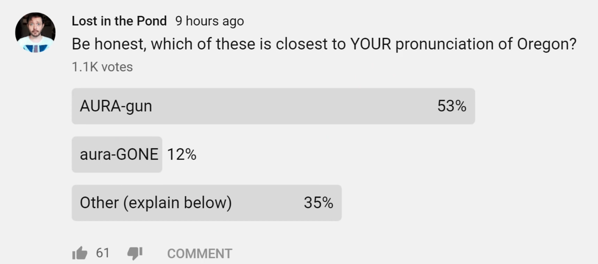

# WEEK 5 - Data Wrangling is Underway - Understanding S3

## Understanding COGs and NonCOGs


### A word about Data Compression

---

Below is a summary of the compression ratios of each method in the worst case: 
- 10-meter Sentinel-2 bands, 
- internal tiling and overviews.
---

| method | Compression Ration | Reason to use |
| ------| -----------| ---------------------|
| LZW 	| 1.16:1 | Quick to run and easy to adopt |
| DEFLATE | 1.38:1 | A slower but better performing alternative to LZW |
| ZSTD 	| 1.45:1 | Promising, CPU intensive but not mature |

    Table. Summary of the results of the different compression algorithms

---


### Email from my OpenDataCube Tasmanian Friend

Hey Tony

And hey Jeff [Briden] and Jon [Morton] of {LCMAP FAME}

Happy to talk about how we do ODC work in the cloud, including doing continental-scale data processing work.

We have some neat new examples using AWS tools like their Simple Queue Service along with Kubernetes to run a whole of Africa pixel quality analysis (so just visiting Sentinel-2's SCL band, over all pixels over Africa) and we're able to process that on 5 large EC2 instances in `~20 minutes, which is fun! Costs us $20 USD.`

Our land cover folks are doing something similar in Australia with LCCS, and I could bring them along. `They're science users, and are happy working with Python and the ODC` along with Kubernetes and job queues to run through that analysis, including iterating quite fast. I'm not sure about the costings of that, but it's been really successful this year!

So yes, happy to talk some time in the new year. Might need to be late Jan when we're all back on board!

Cheers,

---

## IT Security and Compliance Part II

- lower server footprint and vulnerability attack surface
- reduce user numbers in mini-pangeo
- migrate users to big pangeo; teach cookbook examples in the Big Pangeo
- migrate eco users to the eco VPC mini-pangeo
- add encryption where i have to - or decomission less important services
- kelcy - where do you author notebooks? - use teams

---

### The Oregon Pronunciation Conundrum - perhaps we should move to us-east-1
- because that is in Virginia
- I found out the 53% of the folks use the fake-pronunciation for Oregon
	- I am glad I am in the 12% who actually get it right. :-)
	- I am thinking about starting a Facebook campaign




- organ trail?
- or-AGAIN


**My friend once told me "You must be the most pedantic person in the entire world."**
- "Third most, actually." -- :-)

---

## Logan Data Wrangling, S3 and early validation notebooks
- S3 buckets view from the AWS Console
- Quick Sanity Check of NED Data
- in0 --> in1 (COGs) Model Ready Data Perhaps   `s3://eco-w1/in0/rapv2`; etc ....

## Wrangle rapv2 and mrlc_zip
- next week we will use the cloud to create COGs from these in parallel - via docker orchestration

- https://github.com/tonybutzer/logan/blob/main/00-notebooks/00-portal-scraping/00-MRLC-Notebooks/00-data-scraping-grab-zips.ipynb
- [LINK HERE](https://github.com/tonybutzer/logan/blob/main/00-notebooks/00-portal-scraping/00-MRLC-Notebooks/00-data-scraping-grab-zips.ipynb)

## Featured Notebook in Big Pangeo pangeo.chs.usgs.gov

- Steve Labahn got a Pangeo account at the click of a button
- This is a managed service and there are benefits - since many items are taken care of.
- I think you can request a bucket to go with your user ???
- You can definitely play with notebooks here

[ simple example plots big pangeo here](https://pangeo.chs.usgs.gov/user/butzer@contractor.usgs.gov/notebooks/opt/Oldstuff/notebook/00-Tutorial/01-Basic-Plotting-Python/00-example-plots-tony.ipynb)

## IAM - things you will never, ever, need to know - Whew!
- but if you do there's an app for that - I mean a Jupyter Notebook for that!
- aws iam list-attached-role-policies --role-name lsds-developer-ec2
- Jupyter notebooks simplify every complex concept :-)

---

## END of WEEK 5
---

```
{
    "AttachedPolicies": [
        {
            "PolicyName": "ReadOnlyAccess",
            "PolicyArn": "arn:aws:iam::aws:policy/ReadOnlyAccess"
        },
        {
            "PolicyName": "lsds-developer-app-integration",
            "PolicyArn": "arn:aws:iam::574826924367:policy/lsds-developer-app-integration"
        },
        {
            "PolicyName": "lsds-developer-management-tools",
            "PolicyArn": "arn:aws:iam::574826924367:policy/lsds-developer-management-tools"
        },
        {
            "PolicyName": "lsds-developer-compute-containers",
            "PolicyArn": "arn:aws:iam::574826924367:policy/lsds-developer-compute-containers"
        },
        {
            "PolicyName": "lsds-developer-compute-ec2",
            "PolicyArn": "arn:aws:iam::574826924367:policy/lsds-developer-compute-ec2"
        },
        {
            "PolicyName": "lsds-developer-compute-misc",
            "PolicyArn": "arn:aws:iam::574826924367:policy/lsds-developer-compute-misc"
        },
        {
            "PolicyName": "lsds-developer-beta-dms",
            "PolicyArn": "arn:aws:iam::574826924367:policy/lsds-developer-beta-dms"
        },
        {
            "PolicyName": "lsds-developer-alpha-ecr",
            "PolicyArn": "arn:aws:iam::574826924367:policy/lsds-developer-alpha-ecr"
        },
        {
            "PolicyName": "lsds-developer-analytics",
            "PolicyArn": "arn:aws:iam::574826924367:policy/lsds-developer-analytics"
        },
        {
            "PolicyName": "lsds-developer-storage",
            "PolicyArn": "arn:aws:iam::574826924367:policy/lsds-developer-storage"
        },
        {
            "PolicyName": "csr-Developer-Permissions-Boundary",
            "PolicyArn": "arn:aws:iam::574826924367:policy/csr-Developer-Permissions-Boundary"
        },
        {
            "PolicyName": "lsds-developer-database",
            "PolicyArn": "arn:aws:iam::574826924367:policy/lsds-developer-database"
        },
        {
            "PolicyName": "lsds-developer-permission-boundary",
            "PolicyArn": "arn:aws:iam::574826924367:policy/lsds-developer-permission-boundary"
        },
        {
            "PolicyName": "lsds-developer-security-id-compliance",
            "PolicyArn": "arn:aws:iam::574826924367:policy/lsds-developer-security-id-compliance"
        }
    ]
}

```
---

---

```
FROM developmentseed/geolambda:full
WORKDIR /home/geolambda
```


2. WEEK whenever - Delaware River Basin AOI
	- https://panel.holoviz.org/reference/widgets/FileDownload.html

## More Resources - to be sorted
https://code.chs.usgs.gov/pangeo/notebooks/landsat/-/tree/master/Advanced%20Tutorial

https://code.chs.usgs.gov/pangeo/notebooks

## Final Projects
https://earth-env-data-science.github.io/projects.html

## Rich Signell Influence, Experience and Why Cloud

https://medium.com/pangeo/cloud-performant-netcdf4-hdf5-with-zarr-fsspec-and-intake-3d3a3e7cb935

Tony, I discovered something by Accident today.   If you add use "panel" as your urlpath in binder, it displays all your notebooks with Panel as apps.    Check out the last binder link here: 
https://github.com/reproducible-notebooks/Holoviz-Demos#holoviz-demos

[Yesterday 4:22 PM] Signell, Richard P
    Ooh this is cool too!    https://edu.oggm.org/en/latest/explorer.html

[Yesterday 12:44 PM] Signell, Richard P
    Tony, check out Ryan's book! https://earth-env-data-science.github.io/intro
​[Yesterday 12:44 PM] Signell, Richard P
    It's not really a book.   It's actually a course.  He describes how he "onboards" folks to Pangeo (essentially)
Edited​[Yesterday 12:44 PM] Signell, Richard P
    Look at the menu on the left 
​[Yesterday 12:45 PM] Signell, Richard P
    And then look at the Capstone project list: https://earth-env-data-science.github.io/projects.html
​[Yesterday 12:47 PM] Signell, Richard P
    This came up in the discussion here: https://github.com/pangeo-data/jupyter-earth/issues/11#issuecomment-740059579
A curated list of learning resources  · Issue #11 · pangeo-data/jupyter-earthFollowing up from the EarthCube meeting on Sept 10, one item that came to light was that it would be valuable to have a curated / opinionated list of learning resources to onboard scientists to the...github.com​[Yesterday 12:47 PM] Butzer, Tony (Contractor)
    that sounds perfect - this 2nd mouse approach feels nice
​[Yesterday 12:47 PM] Signell, Richard P
    I love that the students all did projects using the tools and have binder links!
​[Yesterday 12:48 PM] Butzer, Tony (Contractor)
    Neal Pastick is already a pangeo zealot - got is aws space today!
​[Yesterday 12:48 PM] Butzer, Tony (Contractor)
    we will be talking to neal - you will be a consultant on our data wrangling pipeline
​[Yesterday 12:53 PM] Signell, Richard P
    Sounds good!


2. LAB
3. Organizing our DATA Inputs in the Cloud
	- Fundamentals of S3
	- S3 is an object store
		- mostly not a big deal - but sometimes ...
	- Data Wrangling
	- Slow Data Transfers
		- ssh and scp
	- VPN do's and dont's 
3. LAB

---

## Project Initiation, Kickoff, and Approach

- Jump in with both feet approach.
- Gabriel Senay, Steffi Kagone - trail blazers
- Neal Pastick as trail blazer
- Continuous Training - Train The trainer
    - Example Steffi and Gabe Parish now writing visualizations directly

## Cloud Immersion Concept

### Use the cloud for EVERYTHING
- website
- kanban
- jupyter hub  - mini-pangeos
- all your data storage
    - move from clunky Netapps and archaic windows storage architectures
- leverage others work
- collaborate like hell

## Why

### For selfish reasons

- Impress your friends
- looks nice on the resume
- its more fun
- you don't have to deal with people you don't like

### Headlines

- Netflix Delivers Billions of Hours of Content Globally by Running on AWS 
- Steffi Kagone does 150 days of work in just THREE!

### Procurement delays not applicable

### Scalability

### USGS/DOI Efficiencies
- Remember DCOI threats
- Remember Cloud First
- Used to be mandates as a top down push
- Now science customer pull
- cost efficiencies
- It is irresponsible not to use the cloud

### Open Source Advantages
- numerous articles on why open source

### Python Momentum

### My favorite - less data wrangling - MORE SCIENCE

